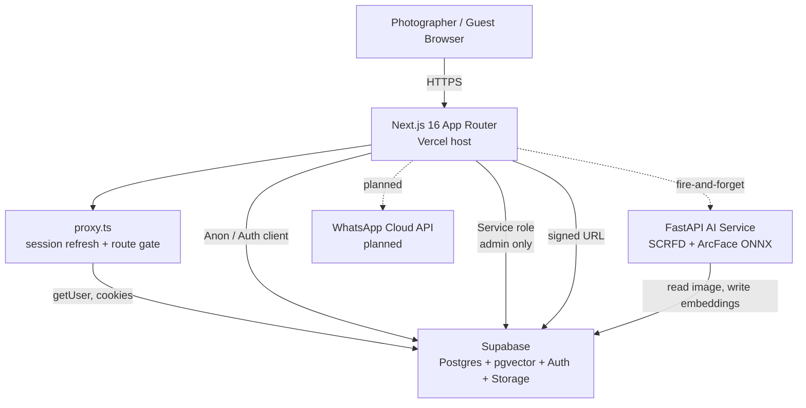
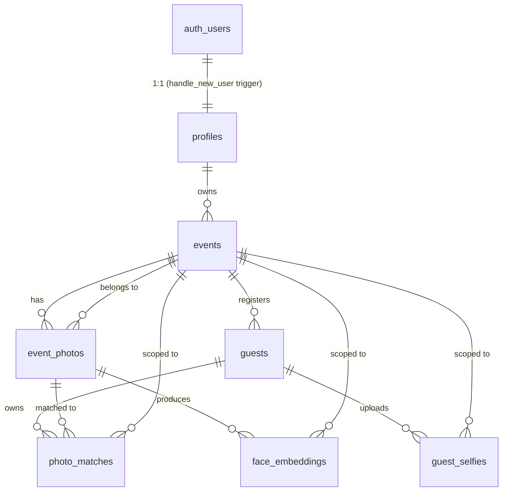
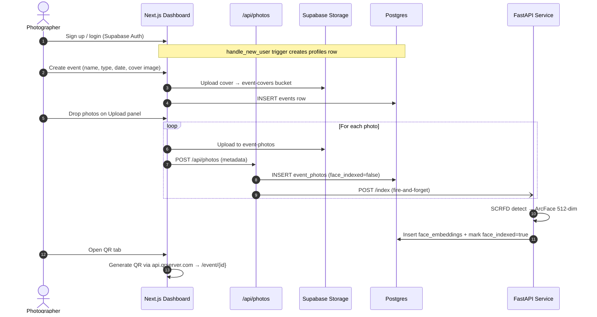
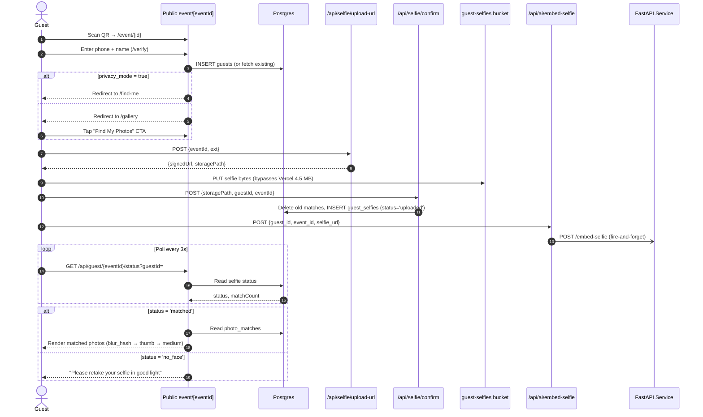

# Spotme / Revela — Codebase Analysis Report

> **Generated:** 2026-06-04  
> **Repository:** `Saaarthak0102/Spotme` · `d:\Spotme`  
> **Auditor scope:** Full repo scan — `app/`, `components/`, `lib/`, `supabase/`, `types/`, `documents/`, root configs  
> **Goal:** Document the actual as-built technology stack, workflows, backend schema, UI/UX design system, and provide actionable observations.

---

## 1. Executive Summary

**Spotme** (publicly branded as **"Revela"**) is an AI-powered event photo platform that lets photographers upload event photos and let guests discover photos of themselves via a selfie match. The codebase is an **MVP that has progressed well beyond scaffolding** — it has consolidated schema migrations, security policies, three distinct user surfaces (landing / dashboard / admin), a documented Python AI service, and a published security audit.

| Dimension | State |
|---|---|
| Stage | Functional MVP, pre-payment-processor |
| Frontend completeness | ~90% (landing + auth + photographer + admin + guest flows all present) |
| Backend schema | Consolidated v2, 8 tables, 3 enums, RLS on every table |
| AI service | Documented in `architecture.md`; not present in this repo (separate `ai-service` repo) |
| Authentication | Supabase Auth with proxy-middleware pattern |
| Payments | Simulated — `POST /api/payments/upgrade` self-assigns plan (flagged in security audit) |
| WhatsApp delivery | Documented but not yet implemented |
| Documentation | 5 detailed `documents/*.md` files already exist |

**Recommended first actions before any feature work:** (1) rotate the credentials flagged in `security_audit.md` (S-01, S-02 are Critical), (2) reconcile the README against the as-built code (Zustand / `hooks/` / `store/` are listed but do not exist), and (3) align the project name ("Spotme" in the repo, "Revela" in the UI/metadata).

---

## 2. Technology Stack (As-Built)

### 2.1 Frontend & Web Application

| Layer | Technology | Version | Evidence |
|---|---|---|---|
| Framework | **Next.js** (App Router) | `16.2.6` | `package.json` |
| UI library | **React** | `19.2.4` | `package.json` |
| Language | **TypeScript** | `^5` (target `ES2017`, strict) | `tsconfig.json` |
| Styling | **Tailwind CSS v4** via `@tailwindcss/postcss` | `^4` | `postcss.config.mjs` |
| Fonts | **Playfair Display** (serif) + **Plus Jakarta Sans** (sans) via `next/font/google` | weights 400/500/600/700 | `app/layout.tsx` |
| Icons | **Google Material Symbols Outlined** | via `<link>` in `<head>` | `app/layout.tsx` |
| Linting | **ESLint v9** + `eslint-config-next` (TS + core-web-vitals) | `^9` / `16.2.6` | `eslint.config.mjs` |
| State management | **React `useState` / `useReducer`** (no Zustand) | — | `components/dashboard/sidebar/workspace-panels.tsx`, etc. |
| Charts | **Hand-rolled SVG** (donut, area-line, horizontal bar, sparkline) | — | `components/admin/charts.tsx` |
| QR generation | **api.qrserver.com** (external) | — | `components/dashboard/workspace-panels.tsx` (`QrPanel`) |
| Supabase client | **`@supabase/ssr`** + **`@supabase/supabase-js`** | `^0.10.3` / `^2.106.2` | `package.json` |
| Node Postgres driver | `pg` (declared; not used in current code) | `^8.21.0` | `package.json` |

> **Note vs. README:** The README's "Folder Structure" section lists `hooks/`, `store/`, `zustand`, `middleware.ts`, and a separate `lib/supabase.ts` — none of these exist in the current code. The real state layer is React hooks, the real middleware is `proxy.ts` (Next.js 16 replaced the `middleware.ts` convention), and the Supabase client is split across `lib/supabase/{client,server}.ts`.

### 2.2 Backend & Data Services

| Layer | Technology | Notes |
|---|---|---|
| Database | **Supabase (Postgres 15+)** | `supabase/consolidated_schema.sql` (v2, 8 tables) |
| Vector search | **pgvector** (`vector(512)`, HNSW cosine index) | `face_embeddings` table — `face_embeddings_cosine_idx` |
| Auth | **Supabase Auth** (JWT, cookie-based SSR) | Anonymous + authenticated + service-role roles |
| Object storage | **Supabase Storage** (S3-compatible) | 3 buckets: `event-covers` (10 MB), `event-photos` (50 MB), `guest-selfies` (10 MB) |
| Migrations | **9 SQL migration files** | `001_add_roles_and_fixes` → `009_fix_profiles_plan_default` |

### 2.3 AI Face Recognition Service (Documented, Separate Repo)

| Layer | Technology | Source |
|---|---|---|
| Runtime | **FastAPI** (Python 3.10+) on Uvicorn | `documents/architecture.md` §2 |
| Concurrency | `asyncio.Semaphore` (default 1) + `psutil` RAM gate | `architecture.md` §5 |
| CV / DL | **OpenCV** + **ONNX Runtime** (CPU) | `architecture.md` §2 |
| Models | InsightFace **`buffalo_l`** — **SCRFD** detector + **ArcFace** 512-dim embeddings | `architecture.md` §2 |
| Output to DB | Inserts rows into `public.face_embeddings`, updates `event_photos.face_indexed` | `architecture.md` §3 |
| Endpoints | `GET /health`, `POST /index`, `POST /embed-selfie`, `POST /upload-selfie`, `POST /search` | `documents/api_reference.md` §2 |

The AI service is **not** part of this repo — it lives in a sibling `ai-service` repository and is reached via `NEXT_PUBLIC_AI_SERVICE_URL`.

### 2.4 Notable Config Files

| File | Purpose |
|---|---|
| `next.config.ts` | Allows Supabase Storage remote images via `*.supabase.co/storage/v1/object/public/**` |
| `proxy.ts` | **Next.js 16's renamed middleware** — refreshes Supabase session, gates `/dashboard` & `/admin`, redirects logged-in users away from `/login` and `/register` |
| `tsconfig.json` | Path alias `@/*` → repo root, strict mode, `moduleResolution: bundler` |
| `eslint.config.mjs` | Flat config extending `eslint-config-next/core-web-vitals` + `/typescript` |
| `postcss.config.mjs` | Single Tailwind v4 plugin |
| `AGENTS.md` / `CLAUDE.md` | Warns that this is Next.js 16 with breaking changes vs. older training data |

---

## 3. Application Architecture

### 3.1 High-Level System Diagram



### 3.2 Client/Server Boundaries

| Concern | Implementation |
|---|---|
| **Browser client** | `lib/supabase/client.ts` → `createBrowserClient<Database>()` |
| **Server client** | `lib/supabase/server.ts` → `createServerClient<Database>()` with `cookies()` adapter |
| **Admin client** | `lib/admin-data.ts` `getAdminClient()` → `createClient(url, SERVICE_ROLE_KEY)` with `autoRefreshToken: false, persistSession: false` |
| **Auth session refresh** | `proxy.ts` calls `supabase.auth.getUser()` on every request that isn't a static asset |
| **Typed schema** | `types/database.ts` is a hand-written `Database` interface (NOT auto-generated from Supabase) that powers `createClient<Database>()` |

### 3.3 Key Cross-Cutting Patterns

- **Signed-URL upload bypass** — `POST /api/selfie/upload-url` issues a Supabase signed upload URL; the browser PUTs the binary directly to storage, sidestepping Vercel's 4.5 MB request body limit. `POST /api/selfie/confirm` writes the metadata row.
- **Polling for AI results** — Guest's `my-photos` page calls `getGuestSelfieStatus(eventId, guestId)` every 3 s, and on `status === 'matched'` renders the `photo_matches` cache. No websockets/Realtime.
- **Late-upload recovery** — `getGuestSelfieStatus` compares `MAX(photo_matches.matched_at)` vs `MAX(event_photos.uploaded_at)`. If new photos exist, status is reset to `uploaded`, forcing a fresh `/api/ai/embed-selfie` call.
- **Cascading storage cleanup** — `lib/storage-cleanup.ts` `deleteEventStorage()` recursively lists & removes from `event-covers` / `event-photos` / `guest-selfies` on event deletion.
- **In-memory rate limiting** — `lib/rate-limit.ts` sliding window per key. Documented as per-process — needs Redis for multi-instance deployments.
- **Storage skip on delete** — RLS cascade handles DB rows; `deleteEventStorage` handles files.

---

## 4. Route Map

### 4.1 Public Surfaces (`(landing)/` + `event/[eventId]/`)

| Route | Component | Purpose |
|---|---|---|
| `/` | `app/(landing)/page.tsx` | Marketing landing (hero, marquee, bento features, testimonial, CTA) |
| `/about`, `/contact`, `/pricing`, `/inquire` | `(landing)/*` | Marketing pages + contact form |
| `/login`, `/register`, `/forgot-password`, `/update-password` | `(auth)/*` | Auth flows |
| `/event/[eventId]` | `event/[eventId]/page.tsx` | Event landing for guests |
| `/event/[eventId]/verify` | `event/[eventId]/verify/` | Phone + name entry; redirects to `/find-me` (privacy) or `/gallery` (open) |
| `/event/[eventId]/find-me` | `event/[eventId]/find-me/` | Selfie upload page (privacy-mode flow) |
| `/event/[eventId]/gallery` | `event/[eventId]/gallery/` | General gallery (non-privacy events) |
| `/event/[eventId]/my-photos` | `event/[eventId]/my-photos/` | Polls status, renders matched photos |

### 4.2 Photographer Workspace (`/dashboard/*`)

| Route | Purpose |
|---|---|
| `/dashboard` | Hero summary + event grid + storage + plan cards |
| `/dashboard/events` | All events list |
| `/dashboard/events/[eventId]` | Workspace overview (folder cards, file explorer, recent photos) |
| `/dashboard/events/[eventId]/uploads` | Drag-drop uploader, queue, progress |
| `/dashboard/events/[eventId]/attendees` | Guest directory (mobile cards + desktop table) |
| `/dashboard/events/[eventId]/qr` | QR code, copy link, download PNG |
| `/dashboard/events/[eventId]/gallery` | Full gallery view |
| `/dashboard/events/[eventId]/settings` | Event settings (incl. privacy mode) |
| `/dashboard/storage` | Plan-level storage overview |
| `/dashboard/account` | Profile + plan settings |

The workspace shell (`components/dashboard/shell.tsx`) provides: dark `bg-zinc-950` left sidebar with Brand, main nav (Dashboard / Events / Storage / Settings), workspace sub-nav (Overview / Uploads / Attendees / QR / Gallery / Settings), profile block, storage footer, top navbar with breadcrumbs + search + notifications, and a `CreateEventModal` triggered from the CTA.

### 4.3 Admin (`/admin/*`)

| Route | Purpose |
|---|---|
| `/admin` | Platform overview: KPI cards, AI health estimator, growth chart, donut breakdowns, top photographers, activity feed, recent events |
| `/admin/photographers` | Manage photographers (create / edit / delete, plan assignment) |
| `/admin/events` | Calendar + list view of all platform events |
| `/admin/inquiries` | Inbox of public contact-form submissions |

### 4.4 API Surface (`/api/*`)

| Endpoint | Auth | Purpose |
|---|---|---|
| `POST /api/photos` | Required | Register uploaded photo in `event_photos`, fire async AI indexing |
| `POST /api/selfie/upload-url` | **None** | Issue signed upload URL for guest selfie |
| `POST /api/selfie/confirm` | **None** | Insert `guest_selfies` row, clear old matches |
| `POST /api/ai/embed-selfie` | **None** | Trigger async face matching via FastAPI |
| `POST /api/payments/upgrade` | Required | Self-assign plan — **no payment check** (see §10 security) |
| `DELETE /api/events/[eventId]` | Required + ownership | Delete event, cascade storage |
| `POST /api/inquire` | **None** | Public contact form |
| `GET /api/admin/stats` | Admin role | Aggregate counts + chart data |
| `GET /api/admin/ai-health` | Admin role | Proxy to FastAPI `/health` |
| `GET/POST/PATCH/DELETE /api/admin/photographers` | Admin role | CRUD photographers |
| `GET /api/admin/inquiries` · `DELETE /api/admin/inquiries?id=` | Admin role | Inquiries |
| `GET /api/guest/[eventId]/photos?guestId=` | Required | Guest's matched photos (for polling) |
| `GET /api/guest/[eventId]/status?guestId=` | Required | Selfie status (for polling) |
| `POST /api/auth/signout` | Required | Sign out |
| `GET /api/auth/callback` | — | OAuth callback |

Full request/response schemas are in `documents/api_reference.md`.

---

## 5. Backend Schema (Consolidated v2)

### 5.1 Entity-Relationship Overview



### 5.2 Tables

| Table | Purpose | Notable columns | Indexes |
|---|---|---|---|
| `profiles` | Mirrors `auth.users`; role + plan + quotas | `role ('admin'\|'photographer')`, `plan ('free'\|'pro'\|'unlimited')`, `max_events`, `max_storage_gb` | PK on `id` |
| `events` | Photographer's event | `event_type`, `status ('draft'\|'active'\|'archived')`, `qr_active`, `privacy_mode`, `cover_url` | `events_owner_id_idx` |
| `event_photos` | Photo metadata | `storage_path`, `thumb_url`, `medium_url`, `blur_hash`, `face_indexed`, `face_indexed_at`, `file_size_bytes`, `mime_type` | `event_photos_event_id_idx`, partial `event_photos_face_indexed_idx` (where `face_indexed = false`) |
| `guests` | Self-registered attendees | `phone`, `display_name` | UNIQUE `(event_id, phone)`, `guests_event_id_idx` |
| `guest_selfies` | Selfie with processing state | `status ('uploaded'\|'processing'\|'matched'\|'no_face')` | `guest_selfies_guest_id_idx`, `guest_selfies_event_id_idx` |
| `photo_matches` | Cached match results | `event_photo_id`, `photo_id` (alias), `guest_id`, `event_id`, `similarity` (float, cosine) | UNIQUE `(guest_id, photo_id)`, `photo_matches_guest_event_idx` |
| `face_embeddings` | Biometric vector data | `embedding vector(512)`, `bounding_box jsonb` | **`face_embeddings_cosine_idx` HNSW (vector_cosine_ops)** — critical for sub-second search |
| `inquiries` | Contact form submissions | `name`, `email`, `phone`, `event_date`, `story` | none |

### 5.3 Enums

```sql
event_type     := 'marriage' | 'hackathon' | 'meetup' | 'corporate' | 'other'
event_status   := 'draft' | 'active' | 'archived'
selfie_status  := 'uploaded' | 'processing' | 'matched' | 'no_face'   -- 'no_face' added in migration 007
```

### 5.4 Helper Functions, Triggers & RLS

- **`public.is_admin()`** — `SECURITY DEFINER` boolean check used by RLS policies to avoid recursion (returns true when the caller's `auth.uid()` has `role = 'admin'` in `profiles`).
- **`public.handle_new_user()`** — `AFTER INSERT` trigger on `auth.users` that upserts a row into `public.profiles` from `raw_user_meta_data`.
- **RLS is enabled on every public table** with explicit `DROP POLICY IF EXISTS` + `CREATE POLICY` blocks (idempotent, safe to re-run).
- **Storage policies** are defined for all three buckets covering public read, authenticated insert, and owner-scoped update/delete.
- **Privacy guards in code** — `lib/guest-data-server.ts` `fetchGuestGallery()` returns `[]` when `privacy_mode = true` so private events never leak general photos through the server.

### 5.5 Storage Buckets

| Bucket | Path convention | Public | Size limit | Allowed MIME types |
|---|---|---|---|---|
| `event-covers` | `{user_id}/{timestamp}.{ext}` | yes | 10 MB | jpeg, png, webp, heic |
| `event-photos` | `{event_id}/{timestamp}-{rand}.{ext}` | yes | 50 MB | jpeg, png, webp, heic, tiff |
| `guest-selfies` | `selfies/{event_id}/{guest_id}/{timestamp}.{ext}` | yes | 10 MB | jpeg, png, webp, heic |

---

## 6. Core Workflows

### 6.1 Photographer Flow



### 6.2 Guest Flow



### 6.3 Admin Flow

1. Admin signs in → proxy.ts allows `/admin` access (role check happens inside each page via `requireAdmin()`).
2. Overview page calls `GET /api/admin/stats` → KPI counts + 6 month growth + donut breakdowns + activity feed.
3. `AIResourceEstimator` polls `GET /api/admin/ai-health` every 10 s for RAM / queue depth / DB connection.
4. CRUD operations on `/api/admin/photographers` (create, edit, delete) use the service-role client to bypass RLS.
5. Inquiries page lists `public.inquiries` rows (admins only via RLS).

### 6.4 Late-Upload Recovery

If a guest's selfie has been matched but the photographer uploads new photos afterwards, the next poll detects:

```
MAX(photo_matches.matched_at) < MAX(event_photos.uploaded_at)
  → status is forced back to 'uploaded'
  → frontend re-triggers /api/ai/embed-selfie
```

This ensures the guest's gallery is always current with the latest photographer uploads without the guest manually re-doing the flow.

---

## 7. UI/UX & Design System

### 7.1 Brand & Tone

| Aspect | Value |
|---|---|
| Product name (UI) | **Revela** |
| Tagline | "Digital Keepsakes for Your Most Cherished Moments" |
| Domain reference | `spotme.revela.com` (in QR panel default) |
| Brand voice | "Fast · Invisible · Emotional · Simple" — guests should never feel like they're using complex software |
| Magic moment | Upload selfie → instantly see your event photos |

### 7.2 Color Palette (Material 3-style tokens, defined in `app/globals.css` `@theme`)

| Token | Hex | Usage |
|---|---|---|
| `--color-primary` | `#94492c` | Deep terracotta — main CTA, brand accents |
| `--color-on-primary` | `#ffffff` | Text on primary |
| `--color-primary-container` | `#d67d5c` | Soft peach — hover states, badges |
| `--color-on-primary-container` | `#541902` | Text on primary container |
| `--color-secondary` | `#8e4e14` | Burnt orange — secondary accents |
| `--color-tertiary` | `#605e59` | Neutral grey — body text |
| `--color-background` | `#fcf9f8` | Warm white — page background |
| `--color-surface` / `--color-surface-bright` | `#fcf9f8` | Cards |
| `--color-surface-container-low` | `#f6f3f2` | Subtle elevation |
| `--color-surface-container` | `#f0eded` | Higher elevation |
| `--color-surface-container-high` | `#eae7e7` | Highest elevation |
| `--color-on-surface` | `#1b1c1c` | Primary text |
| `--color-on-surface-variant` | `#54433d` | Secondary text |
| `--color-outline` | `#87736c` | Borders |
| `--color-outline-variant` | `#dac1b9` | Soft borders |

### 7.3 Typography

| Family | Source | Usage | CSS Variable |
|---|---|---|---|
| **Playfair Display** (serif) | `next/font/google` (weights 400/500/600/700) | Brand wordmark, h1/h2 headings, italic emphasis, testimonial quotes | `--font-serif` / `--font-playfair` |
| **Plus Jakarta Sans** (sans) | `next/font/google` (weights 400/500/600/700) | UI text, body, nav, buttons, cards, tables | `--font-sans` / `--font-plus-jakarta` |
| **Material Symbols Outlined** | `<link>` in `<head>` | All icons (filled, wght 400, opsz 24 default) | `.material-symbols-outlined` |

### 7.4 Signature Visual Patterns

| Pattern | CSS Class | Effect |
|---|---|---|
| **Glassmorphism** | `.glass`, `.glass-card`, `.glass-subtle`, `.glass-dark` | `backdrop-filter: blur(20-24px)` with semi-transparent white & warm shadow |
| **Soft-lift shadow** | `.soft-lift` | `0 10px 30px -5px rgba(148, 73, 44, 0.05)` warm shadow |
| **Card hover lift** | `.feature-card`, `.dash-card`, `.dash-card-accent` | `translateY(-8px)` + intensified warm shadow, 0.4 s cubic-bezier(0.22, 1, 0.36, 1) |
| **Warm gradient** | `.gradient-warm`, `.gradient-warm-radial`, `.gradient-hero-dash`, `.gradient-mesh` | Peach radial/linear gradients |
| **Status pulse** | `.status-live` | Green dot with `box-shadow` keyframe pulse for live indicators |
| **Marquee** | `.animate-marquee` | 45 s linear infinite phone-album carousel; pauses on hover |
| **Page enter** | `.page-enter` / `.animate-page-enter` | 0.5 s cubic-bezier opacity + translateY |
| **Stagger entrance** | `.stagger-in` | Sequential fade-up children |
| **Floating hero** | `.float-anim` | 8 s ease-in-out translateY(±15px) + scale(1.02) |
| **Text zoom** | `.text-zoom-pulse`, `.text-zoom-hover` | 6 s breathing scale 1↔1.05; on-hover 1.08 |
| **Word fade** | `.animate-fade-up-word` | Hero word crossfade with blur every 2.5 s |
| **Shimmer placeholder** | `.shimmer` | 1.8 s shimmer gradient for loading states |
| **Sidebar drawer** | `.sidebar-drawer` / `.sidebar-overlay` | 280 px slide-in, 0.35 s cubic-bezier |

### 7.5 Spacing Tokens

```css
--spacing-container-max: 1200px;     /* main content max-width */
--spacing-margin-desktop: 40px;     /* page side padding (lg+) */
--spacing-margin-mobile: 20px;      /* page side padding (<lg) */
--spacing-gutter: 24px;             /* grid gap */
```

Signature corner radius is **26 px** (`rounded-[26px]`) on most cards; modals use 28-32 px; small chips use 12-16 px.

### 7.6 Layout Patterns

- **Landing page**: Single-column centered hero with rotating italic word, then phone-album marquee, then 4-cell bento features grid, then secondary image marquee, then testimonial, then CTA.
- **Dashboard shell**: Sticky dark `bg-zinc-950` left sidebar (collapsible), white top navbar with breadcrumbs + search + notifications + profile dropdown, main content area.
- **Workspace pages**: Page header (`eyebrow` + `title` + `detail` + `action`), then content panels inside `EventWorkspaceShell`.
- **Admin shell**: Warm beige `bg-[#FAF5EF]` sidebar, content max-w-1280, generous 8-section layout (KPIs → AI health → month stats → growth chart → donuts → top + activity → events table).
- **Guest flow**: Vertical card-centered layouts, large input fields, prominent camera capture button, animated scanning state during AI processing.

### 7.7 Accessibility

- `prefers-reduced-motion: reduce` overrides disable every animation, transition, and transform.
- Semantic HTML (`<header>`, `<main>`, `<nav>`, `<aside>`, `<section>`, `<article>`, `<table>`).
- `aria-label` on icon-only buttons (notifications, close, sidebar toggle).
- Form fields use `label` elements with proper associations.
- Color contrast passes for primary text (`#1b1c1c` on `#fcf9f8`).
- `display: none` on decorative content via `.hidden` utility.

### 7.8 Dashboard Component Inventory

| Component | File | Purpose |
|---|---|---|
| `Brand` | `components/dashboard/shell.tsx` | Logo + wordmark with hover scale |
| `ProfileBlock` (sidebar) | `shell.tsx` | Avatar + plan badge + popover menu |
| `NavbarProfile` (topbar) | `shell.tsx` | Round avatar + cloud usage dropdown |
| `StorageFooter` (sidebar) | `shell.tsx` | 82% usage bar + Upgrade button |
| `TopNavbar` | `shell.tsx` | Breadcrumbs, search, notifications, profile |
| `CreateEventModal` | `shell.tsx` | Multi-field event creation with cover upload |
| `NotificationDrawer` | `shell.tsx` | Right-side panel with sync animation |
| `EventWorkspaceShell` | `shell.tsx` | Layout for `/dashboard/events/[id]/*` |
| `PageHeading` | `shell.tsx` | Eyebrow + title + detail + action |
| `EventOverviewPanel` | `workspace-panels.tsx` | Mini stats, folder grid, file explorer (grid/list) |
| `UploadsPanel` | `workspace-panels.tsx` | Drag-drop zone, progress, queue, recent grid |
| `AttendeesPanel` | `workspace-panels.tsx` | Search, mobile cards, desktop table |
| `QrPanel` | `workspace-panels.tsx` | QR display, copy, download, preview link |
| `HeroSummary`, `EventCard`, `EventsGrid`, `StorageCard`, `PlanCard` | `dashboard-cards.tsx` | Dashboard home cards |
| `AdminSidebar`, `AdminOverview`, `AdminPhotographers`, `AdminEvents`, `AdminInquiries` | `admin-panels.tsx` | All admin pages |
| `AIResourceEstimator` | `admin-panels.tsx` | Polls `/api/admin/ai-health` every 10 s |
| `DonutChart`, `AreaLineChart`, `HorizontalBarChart`, `MiniSparkline` | `admin/charts.tsx` | Hand-rolled SVG charts |
| `PhotographerModal` | `admin-panels.tsx` | Add/Edit photographer dialog |

---

## 8. Security Posture

The repo includes a thorough `documents/security_audit.md` (dated 2026-06-03) with 9 validated findings. Summary:

| # | Severity | Finding | Status |
|---|---|---|---|
| S-01 | **Critical** | Hardcoded prod credentials in `ai-service/.env` AND `.env.example` | **Rotate now** |
| S-02 | **Critical** | Hardcoded prod credentials in `Spotme/.env.local` (Service Role, S3 keys, DB password) | **Rotate now** |
| S-03 | **High** | `POST /api/ai/embed-selfie` has no auth — guest_id injection / IDOR | Patch before launch |
| S-04 | **High** | AI service CORS `allow_origins=["*"]` | Patch before launch |
| S-05 | **High** | `POST /api/selfie/upload-url` no guest validation | Patch before launch |
| S-06 | **Medium** | RLS on `guest_selfies` and `photo_matches` uses `using (true)` for guest self-reads | Patch before launch |
| S-07 | **Medium** | `POST /api/payments/upgrade` self-assigns plan with no payment check | Replace with Stripe webhook |
| S-08 | **Low** | `NEXT_PUBLIC_AI_SERVICE_URL` leaks internal hostname to client | Rename to `AI_SERVICE_URL` |
| S-09 | **Low** | `insertInquiry` uses service-role client unnecessarily | Move to anon client |

**Auth defense-in-depth (good):** Input sanitization (`lib/auth-validate.ts`), user-friendly error mapping (`lib/auth-errors.ts`), in-memory rate limiting (`lib/rate-limit.ts`), signed-URL storage uploads, RLS on every table, storage policies per bucket, separate anon/auth/service-role client separation.

**Validation helpers in `lib/auth-validate.ts`:** `sanitizeText`, `validateEmail`, `validatePassword` (8-128 chars, no whitespace-only), `validateFullName` (rejects HTML & control chars), `containsDangerousInput` (rejects XSS, SQL-injection patterns), composite `validateRegisterForm` / `validateLoginForm`.

---

## 9. Observations & Recommendations

### 9.1 Documentation vs. Reality Mismatches

| README / Doc Says | Code Actually Has | Action |
|---|---|---|
| `lib/supabase.ts` | `lib/supabase/{client,server}.ts` split | Update README |
| `middleware.ts` | `proxy.ts` (Next.js 16 rename per AGENTS.md) | Update README |
| `store/auth-store.ts`, `store/event-store.ts` | Not present — React `useState` only | Remove from README or plan Zustand adoption |
| `hooks/use-upload.ts`, `hooks/use-toast.ts`, `hooks/use-mobile.ts` | Not present | Either implement or remove from README |
| `components/ui/{button,card,dialog,input,modal}.tsx` | Not present — raw `<button>`, `<input>`, etc. used throughout | Either extract a primitives layer or remove from README |
| `lib/{ai,qr,whatsapp,utils}.ts` | Not present — QR uses external API; AI is separate repo; WhatsApp not implemented | Implement or remove from README |
| `styles/animations.css` | Not present — animations live in `app/globals.css` | Reconcile |
| `public/{images,logos,icons}/` | Not present — landing uses Google-hosted placeholder images | Add real assets |

### 9.2 Architectural Strengths

1. **Single consolidated schema** (`supabase/consolidated_schema.sql`) means a fresh Supabase project can be bootstrapped with one SQL run — excellent for onboarding and disaster recovery.
2. **Idempotent migrations** (`DROP IF EXISTS` then `CREATE`) make re-runs safe.
3. **Privacy-by-default server guards** — `fetchGuestGallery()` returns `[]` for private events regardless of client logic.
4. **Hand-written `Database` type** keeps the client fully typed without a build step to generate types.
5. **Service-role client is properly isolated** to `lib/admin-data.ts` and `proxy.ts` only.
6. **No third-party UI library** (no MUI / Chakra / shadcn) means full design control and zero upgrade churn — at the cost of more component code to maintain.
7. **Self-rolled SVG charts** are small, dependency-free, and stylable.
8. **Warm color palette + Playfair/Plus Jakarta pairing** gives the product a distinct, premium-photography studio identity.

### 9.3 Architectural Risks & Improvement Areas

| Risk | Impact | Suggested fix |
|---|---|---|
| **`proxy.ts` is non-standard** — per AGENTS.md this is Next.js 16's rename, but the `matcher` excludes image extensions only; verify the regex doesn't unintentionally exclude routes like `/api/admin/*` | Auth gate bypass | Audit matcher in proxy + add a smoke test |
| **Polling every 3 s for AI results** | Unnecessary DB load; poor UX for slow matches | Migrate to Supabase Realtime channels on `guest_selfies` and `photo_matches` |
| **In-memory rate limit** (`lib/rate-limit.ts`) | Useless across serverless instances | Replace with Upstash Redis or Vercel KV |
| **Public selfie bucket** | Any URL is enumerable | Tighten RLS to owner-scoped reads + add `blur_hash` to default responses |
| **External QR generation** (`api.qrserver.com`) | Third-party tracking + reliability risk | Self-host a tiny QR endpoint (e.g. `qrcode` npm) |
| **No image optimization** on user uploads | Slow galleries on mobile | Generate `thumb_url` / `medium_url` server-side (columns already exist) and serve via `next/image` |
| **Hardcoded `NEXT_PUBLIC_AI_SERVICE_URL`** | Internal hostname exposed; can be exploited if AI service is deployed with weak auth | Rename to non-public `AI_SERVICE_URL` (S-08) |
| **No automated tests** in this repo (no `__tests__/`, no Playwright/Vitest) | Regressions go unnoticed | Add a Vitest suite for `lib/*-data.ts` and Playwright E2E for the 3 critical flows |
| **Storage cleanup runs in-band on event delete** | Slow API response; failures leave orphans | Move to a background job (e.g. Supabase Edge Function or queue) |
| **`pg` driver declared but unused** | Dead dep bloat | Remove from `package.json` |

### 9.4 What is Documented but Not Yet Built

| Documented in | Reality | Notes |
|---|---|---|
| `architecture.md` — WhatsApp Cloud API delivery for "no_match" | Not implemented | Requires Twilio/Meta Cloud API credentials |
| `architecture.md` — Email notifications | Not implemented | SMTP simulation only |
| `features_and_flows.md` — Lightbox features (prev/next, download) | Likely partial | Check `event/[eventId]/my-photos/` |
| `features_and_flows.md` — `blur_hash` progressive loading | Column exists; rendering may be partial | Verify lightbox component |

---

## 10. Documentation Index

The project ships a strong documentation set in `documents/`:

| File | Purpose |
|---|---|
| `README.md` | High-level product overview, folder structure (partly aspirational), core flows, MVP feature list |
| `documents/architecture.md` | System architecture with mermaid diagrams, FastAPI AI service spec, env var reference, quality guards |
| `documents/database.md` | Schema extensions, table definitions, indexes, functions, triggers, RLS policies, storage buckets |
| `documents/features_and_flows.md` | Photographer & guest journeys, late-upload recovery, FastAPI resource safeguards, storage cleanups |
| `documents/api_reference.md` | Full Next.js + FastAPI endpoint reference with request/response JSON, status codes, auth requirements |
| `documents/security_audit.md` | 9 validated findings (2 Critical, 4 High, 2 Medium, 2 Low) with PoC and remediation roadmap |
| `documents/CODEBASE_ANALYSIS.md` | **This document** — single-file analysis across stack, schema, UI/UX, security, recommendations |

---

## 11. Conclusion

**Spotme / Revela is a well-structured, mostly-complete MVP** with a clear product vision, a solid Supabase + pgvector backend, a thoughtful warm-toned design system, and unusually thorough documentation for its size. The codebase is small enough to navigate in an afternoon but mature enough to demonstrate real engineering decisions: idempotent migrations, RLS on every table, late-upload recovery, privacy-mode guards, signed-URL storage uploads, and a published security audit.

The most pressing gaps are **not** feature gaps — they are the two **Critical credential leaks** in `security_audit.md` and the **README vs. reality drift** that misleads new contributors. Once credentials are rotated and docs reconciled, the project is positioned to ship the WhatsApp delivery layer, the Stripe payment integration, and Supabase Realtime polling replacement as the next milestones.

**Top 3 next steps (in order):**
1. 🔴 **Rotate Supabase Service Role, S3 keys, and DB password** flagged in S-01 / S-02.
2. 🟠 **Patch the 4 High-severity issues** (S-03, S-04, S-05, plus S-07 for payments) before any paid traffic.
3. 🟡 **Reconcile README** with the actual folder structure, and add Vitest + Playwright scaffolding for the three critical flows (guest selfie → match, photographer upload → indexing, admin login).

---

*End of report.*
