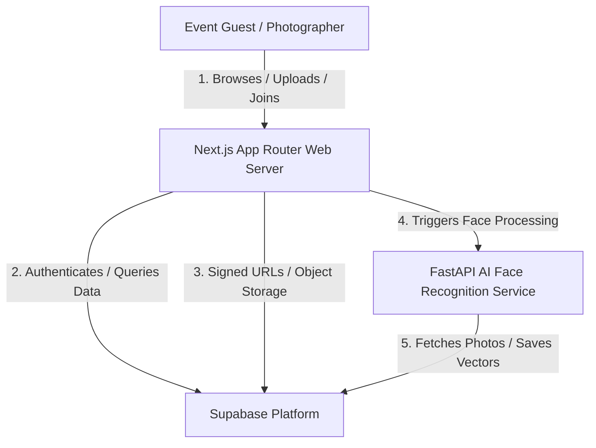
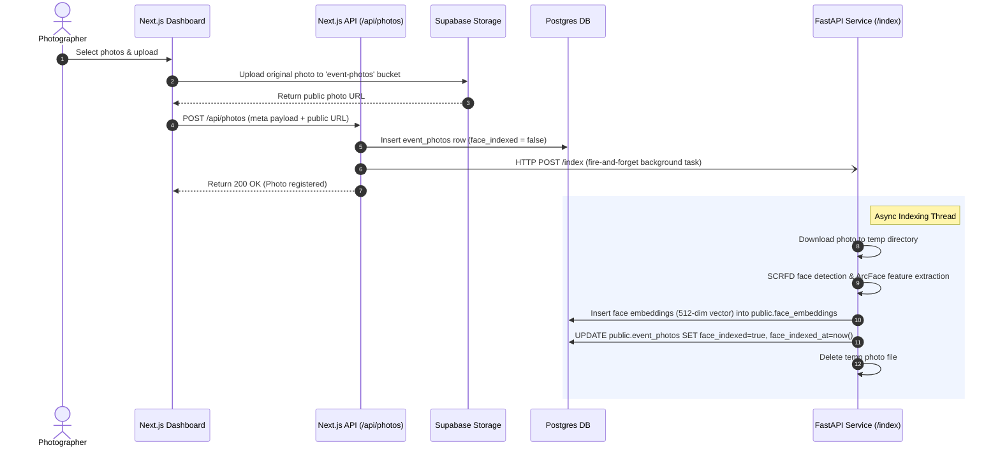
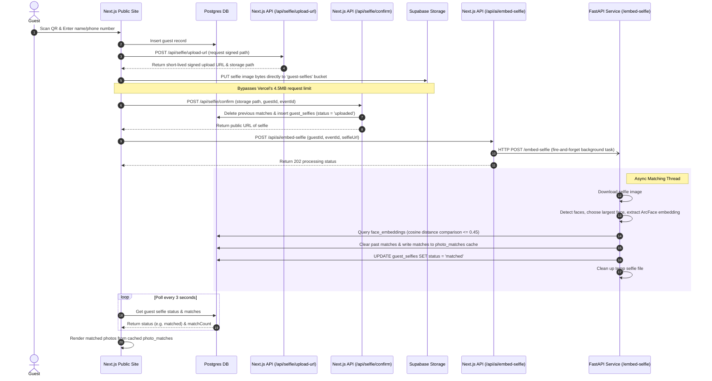

# System Architecture

This document provides a comprehensive overview of the **Spotme** system architecture, the technologies used, component interactions, and the required environment configuration.

---

## 1. High-Level System Overview

Spotme is an AI-powered event photography platform designed to deliver instant photo discovery for guests. 

The system comprises three core components:
1. **Next.js Web Frontend & API Server**: Serves responsive pages to photographers and guests, manages auth/sessions, and handles meta database inserts and transaction control.
2. **Supabase Cloud Backend**: Serves as the storage provider (buckets for event covers, original photos, and selfies), authentication authority, and relational database hosting the `pgvector` index.
3. **FastAPI AI Face Recognition Service**: Runs in a Python environment to execute compute-heavy face detection (SCRFD) and facial recognition (ArcFace via ONNX) on uploaded media.

---

## 2. Technology Stack

### Frontend & Web Application
* **Framework**: Next.js 16.2.6 (App Router)
* **Library**: React 19.2.4
* **Styling**: Tailwind CSS v4 (using Modern CSS utility variables)
* **State Management**: Zustand (for UI states, uploading queues, and authentication variables)
* **Icons**: Google Material Symbols

### Database & Backend Services
* **Provider**: Supabase
* **Database**: PostgreSQL (v15+)
* **Vector Database Extension**: `pgvector` (512-dimension vector representations for face embeddings)
* **Storage**: Supabase Storage Buckets (S3-compatible API with pre-signed URLs)
* **Auth**: Supabase Auth (JWT credentials, sessions, and secure cookies)

### AI Face Recognition Service
* **Framework**: FastAPI (Python 3.10+)
* **Concurrency**: Uvicorn server utilizing `asyncio.Semaphore` task queuing
* **Computer Vision**: OpenCV (`cv2` for image loading, validation, and encoding)
* **Deep Learning Framework**: ONNX Runtime (optimized for CPU execution)
* **Inference Model (buffalo_l)**:
  * **Face Detection**: SCRFD (Sub-millisecond Face Detection)
  * **Face Recognition/Feature Extraction**: ArcFace (normed 512-dimension output embeddings)
* **Process Monitor**: `psutil` (for live free RAM tracking)

---

## 3. Core Component Flows

### A. Photographer Upload & AI Indexing Flow
When a photographer uploads a photo to an event dashboard:

### B. Guest Onboarding, Selfie Matching & Photo Retrieval Flow
When a guest scans a QR code to join an event:

---

## 4. Configuration & Environment Variables

### A. Next.js Web App (`.env.local`)
Required in the web application environment:

| Variable Name | Description | Example / Default |
| :--- | :--- | :--- |
| `NEXT_PUBLIC_SUPABASE_URL` | Public endpoint for the Supabase project | `https://[proj-ref].supabase.co` |
| `NEXT_PUBLIC_SUPABASE_ANON_KEY` | Public client anonymous key | `eyJhbGciOi...` |
| `SUPABASE_SERVICE_ROLE_KEY` | Admin secret key (Server-only) | `eyJhbGciOi...` |
| `SUPABASE_ACCESS_KEY_ID` | Storage access key ID (S3 protocol) | `3f68b391a...` |
| `SUPABASE_SECRET_ACCESS_KEY` | Storage secret access key (S3 protocol) | `d002bdeeb...` |
| `NEXT_PUBLIC_AI_SERVICE_URL` | Host url of the FastAPI AI Service | `http://127.0.0.1:8000` |
| `DATABASE_PASSWORD` | Postgres database superuser password | `[password-here]` |

### B. FastAPI AI Service (`ai-service/.env`)
Required in the python service environment:

| Variable Name | Description | Example / Default |
| :--- | :--- | :--- |
| `DATABASE_URL` | Connection string for Postgres (prefer transaction pooler port `6543`) | `postgresql://postgres.[ref]:[pass]@[host].pooler.supabase.com:6543/postgres?sslmode=require` |
| `SUPABASE_URL` | Public endpoint for Supabase API requests | `https://[proj-ref].supabase.co` |
| `SUPABASE_KEY` | Supabase Service Role Key (for storage uploads) | `eyJhbGciOi...` |
| `PORT` | Local binding port | `8000` |
| `HOST` | Local network binding address | `0.0.0.0` |
| `MAX_CONCURRENT_AI` | Limit of concurrent face inference jobs running | `1` (for 512MB RAM), `3` (for 2GB RAM) |
| `MAX_QUEUE_SIZE` | Maximum depth of background task queue | `10` |
| `MIN_FREE_RAM_MB` | RAM boundary limit to prevent OOM termination | `200` |

---

## 5. Architectural Quality Guards

* **Memory Protection**: FastAPI monitors memory usage on each request via `psutil`. If free RAM falls below `MIN_FREE_RAM_MB` (default 200MB), the request is rejected with `503 Service Unavailable` to protect the host container from OOM crashes.
* **Concurrency Gates**: A global `asyncio.Semaphore` tracks active ONNX model loads and runs. This serializes hardware intensive execution to prevent massive CPU throttling or starvation.
* **Storage Bypass**: Signed upload URLs generated by Supabase Storage are used directly by client browsers. This ensures that large files (e.g. 10MB+ photographer uploads or high-resolution guest selfies) bypass the Next.js server limits, reducing memory and bandwidth consumption.
* **Caching Layer**: Results of the vector search are stored directly in the `photo_matches` database table. The web application only performs lightweight SQL reads on page loads instead of requesting AI model execution, optimizing battery, bandwidth, and API consumption.
