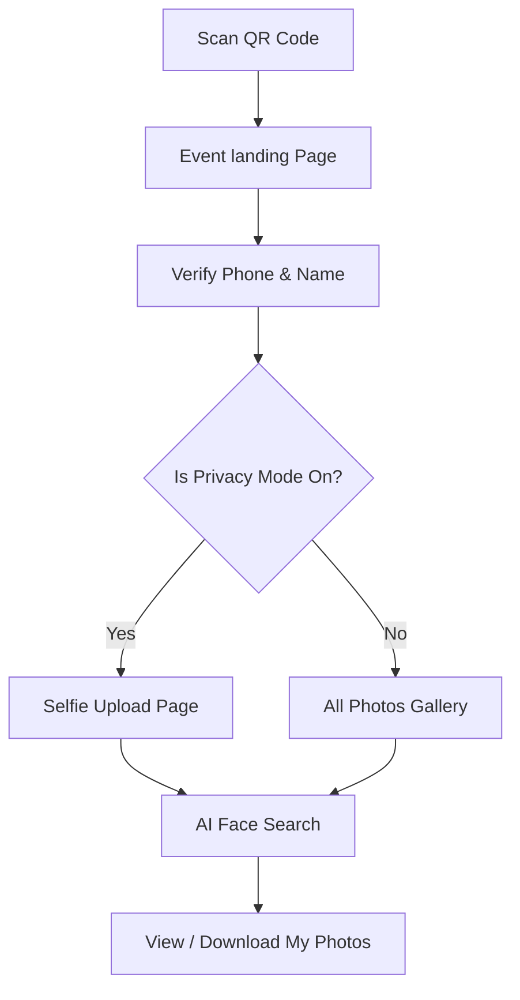

# Core Features & User Flows

This document details the functional user journeys, specific features, caching mechanics, and background optimization techniques implemented in **Spotme**.

---

## 1. Photographer Journeys

Photographers are the content creators who set up events, manage photos, and purchase subscriptions.


### A. Account Onboarding & Plans
* **Registration**: Photographers sign up with email and password via `/(auth)/register`. A database trigger automatically initializes a record in `public.profiles`.
* **Plans and Limits Enforcement**:
  * **Free**: Limit of `1` event project and `10GB` of storage.
  * **Pro**: Limit of `5` event projects and `100GB` of storage.
  * **Unlimited**: Limit of `999,999` event projects and `1000GB` of storage.
* **Upgrades**: Upgrades are triggered by calling `POST /api/payments/upgrade`. In a production environment, this is hooked into Stripe webhooks. Once upgraded, `max_events` and `max_storage_gb` are recalculated and updated in the user's profile.

### B. Event Creation & Settings
* **Creation**: Photographers create events by providing a name, location venue, date, category (event type), and cover photo.
* **Cover Photo Storage**: Bypasses local servers by writing directly to the `event-covers` storage bucket.
* **Event States**:
  * **Draft**: Private to the photographer.
  * **Active**: Onboarding QR is active, public pages are live.
  * **Archived**: Hidden from list, public scanner redirects to expired landing.
* **Privacy Mode**: An event toggle. If enabled, guests scanning the QR code cannot view the general gallery. They must upload a selfie, and they will only see photos matching their own face.

### C. Photo Uploading & Processing
* **Drag-and-Drop Uploader**: Custom uploader component handles batch photo selection.
* **Storage Upload**: Files are written to the `event-photos` bucket.
* **Metadata Registration**: For each photo successfully uploaded to storage, a call is made to `POST /api/photos` to insert it into `public.event_photos`.
* **Async Face Indexing**: Next.js fires an async, non-blocking POST request to the Python AI service's `/index` endpoint. The AI service downloads the file, processes faces, stores 512-dim descriptors in `public.face_embeddings`, and marks `face_indexed = true` in the DB.

### D. QR Code & Attendance
* **QR Page**: Photographers can download or print a customized vector QR code that points guests directly to `https://[domain]/event/[eventId]`.
* **Attendee List**: A live dashboard table that counts registered guests, lists their names, phone numbers, selfie status, and photo match counts.

---

## 2. Guest Journeys

Guests are anonymous participants who join events via physical QR code scanners to locate photos of themselves.



### A. Landing & Onboarding
1. **Entry**: Guest scans the QR code at the venue and is directed to the public route `/event/[eventId]`.
2. **Registration**: Guest clicks "Join This Event" and goes to `/event/[eventId]/verify`.
3. **Fields & Country Code Validation**:
   * Guest inputs their full name and phone number.
   * A country code selector (defaulting to `+91` India) matches phone number character lengths against validation rules (e.g. 10 digits for India/USA, 9 for UAE/Australia).
   * Once validated, `registerGuest` adds the user to the `guests` table.
4. **Session Persistence**: The guest's generated ID and name are saved in `localStorage` under `guest_id_[eventId]` and `guest_name_[eventId]` to maintain persistent session states.

### B. Flow Diversion by Privacy Mode
After verification, the page queries the event's privacy setting:
* **Privacy Mode ON**: The guest is redirected to `/event/[eventId]/find-me` immediately. They cannot browse general files.
* **Privacy Mode OFF**: The guest is redirected to `/event/[eventId]/gallery` where they can browse all photos, with a floating CTA to "Find My Photos" via selfie upload.

### C. Selfie Upload Pipeline
* **Capture Options**: Clicking "Take a Selfie" opens the camera capture prompt on mobile devices (using `capture="user"`). Alternatively, users can choose an existing photo from their image gallery.
* **Vercel Request Bypass**: 
  1. Frontend calls `/api/selfie/upload-url` to get a short-lived signed URL from Supabase storage.
  2. The frontend PUTs the binary image data directly to Supabase storage. This bypasses Vercel's 4.5MB request limit, allowing high-resolution selfies to upload instantly.
  3. Frontend calls `/api/selfie/confirm` to write the selfie metadata to the database, set status to `'uploaded'`, and delete previous matches.
  4. Frontend calls `/api/ai/embed-selfie` to initiate background AI matching.

### D. AI Polling & Personal Gallery
* **Processing Screen**: The guest is redirected to `/event/[eventId]/my-photos` showing an active scanning animation.
* **Polling Loop**: The client polls `getGuestSelfieStatus` every 3 seconds.
* **Dynamic Gallery Update**: As soon as the polling response returns a status of `'matched'`, the client renders the matching photos from the `photo_matches` table.
* **Selfie Failure**: If no face is detected, the status changes to `'no_face'`, and the guest is prompted to upload a clearer, well-lit image.
* **Lightbox Features**:
  * Progressive image loading using base64 `blur_hash` placeholders.
  * Image enlargement lightbox with previous/next navigation buttons.
  * Custom download handles to fetch original high-res files.

---

## 3. Caching & Performance Optimization

### A. Cache Stale Detection (Late Upload Recovery)
**Problem**: Guests often upload selfies before the photographer finishes uploading all event photos. If matches are pre-computed once, any subsequent uploads by the photographer would be missed.

**Solution**:
Every time the guest visits `/event/[eventId]/my-photos`, the client calls `getGuestSelfieStatus`. The database compares:
1. The timestamp of the guest's latest matching photo (`matched_at` in `photo_matches`).
2. The timestamp of the latest photo uploaded by the photographer (`uploaded_at` in `event_photos`).

```text
If (latest_photo_upload_time > last_match_time) {
    status = 'uploaded' (Force recalculation)
}
```
If new photos are found, the status is set back to `'uploaded'`. This triggers a new call to `/api/ai/embed-selfie` to process the selfie against the newly uploaded photos, ensuring the guest's photo collection is always up to date.

### B. FastAPI Resource Safeguards
* **CPU Concurrency Gate**: Face detection models are highly resource-intensive. To prevent CPU throttling or resource starvation, a global `asyncio.Semaphore` restricts ONNX inference processes to a configured limit (default: `1` parallel job).
* **RAM Health Check**: FastAPI tracks available host memory using `psutil`. If free memory falls below `MIN_FREE_RAM_MB` (default 200MB), incoming requests are rejected with a `503 Service Unavailable` status. The Next.js caller handles this gracefully by placing the task in a queue for retry.

### C. Storage Cleanups on Delete
To prevent orphan storage files from consuming storage quota:
When a photographer deletes an event (via `DELETE /api/events/[eventId]`):
1. Database RLS rules automatically cascade-delete all rows linked to that event in `event_photos`, `guests`, `guest_selfies`, `photo_matches`, and `face_embeddings`.
2. Next.js calls `deleteEventStorage` in the background (using the service role client).
3. The server deletes the event cover from `event-covers`.
4. The server recursively lists and deletes all files inside the event's subfolders in the `event-photos` and `guest-selfies` storage buckets.
